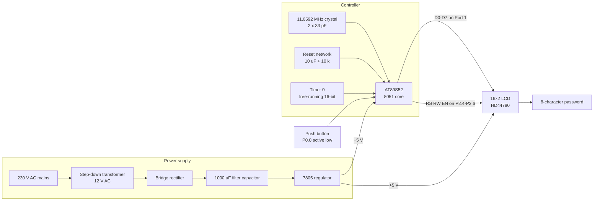

# 🔐 Random Password Generator using 8051 Microcontroller

An 8-character random password generator built on an **AT89S52 (8051 family)** microcontroller. A single push-button press generates a fresh password and prints it on a **16x2 LCD**. Randomness is harvested from the live **Timer 0** counter registers at the instant the button is pressed, so the value is different on every press.

> **Microcontrollers (MC) Project – I**  
> Dept. of Electronics & Communication Engineering  
> Chaitanya Bharathi Institute of Technology (A), Hyderabad – 500075  
> Academic Year 2025–2026

-1f6feb?style=flat-square)


---

## 📌 Overview

Passwords chosen by humans are predictable. This project moves password creation into hardware: an offline, standalone device with no OS, no network stack and no storage, so a generated password exists only on the LCD for as long as you need to read it.

On power-up the LCD shows `Press Key`. Pressing the button clears the display and prints 8 characters, one at a time, drawn from a 68-character alphabet of uppercase letters, lowercase letters, digits and symbols.

## ✨ Features

- **8-character passwords** from a mixed alphabet (A–Z, a–z, 0–9, `@#$%&*`)
- **Timer-based pseudo-randomness** — `(TH0 + TL0) % CHARSET_SIZE` sampled at button-press time
- **Single-button operation** with 50 ms software debounce and release detection
- **Instant feedback** — full password rendered in roughly 400 ms
- **Fully offline** — nothing is transmitted, logged or written to non-volatile memory
- **Low cost** — built entirely from standard lab components

## 🗺️ System Block Diagram



📐 **Full set of diagrams — pin-level schematic, LCD netlist, reset/crystal/button circuits, power supply chain, firmware flowchart, runtime sequence and LCD strobe timing — is in [`docs/DIAGRAMS.md`](docs/DIAGRAMS.md).**

## 🧰 Hardware Used

This project was assembled on a **college 8051 trainer board**, which supplies the crystal, reset circuit, regulated +5 V rail, onboard LCD and pre-wired switch blocks. The table below lists the equivalent discrete parts for anyone rebuilding it from scratch — both build paths are documented in [`docs/HARDWARE_SETUP.md`](docs/HARDWARE_SETUP.md) §0.

| Component | Specification | Purpose |
|---|---|---|
| Microcontroller | AT89S52 (8051 core, 8 KB flash) | Runs the firmware |
| Crystal oscillator | 11.0592 MHz + 2 × 33 pF | System clock |
| Reset circuit | 10 µF capacitor + 10 kΩ resistor | Power-on reset |
| Display | 16x2 alphanumeric LCD (HD44780) | Shows prompt and password |
| Input | Momentary push button | Triggers generation |
| Power supply | 230 V AC → step-down transformer → bridge rectifier → 7805 | Regulated +5 V |
| Misc | Breadboard/PCB, jumpers, pull-up resistor, potentiometer for LCD contrast | Assembly |

## 🔌 Pin Mapping

As implemented in [`src/password_generator.c`](src/password_generator.c) and **verified against the assembled board**:

| Signal | Port pin | Physical pin (DIP-40) | Notes |
|---|---|---|---|
| LCD data bus D0–D7 | **P1.0–P1.7** | 1–8 | 8-bit mode, `#define LCD P1` |
| LCD `RS` (register select) | **P2.4** | 25 | 0 = command, 1 = data |
| LCD `RW` (read/write) | **P2.5** | 26 | Held at 0 (write only) |
| LCD `EN` (enable) | **P2.6** | 27 | High-low strobe latches each byte |
| Push button | **P0.0** | 39 | Active low; needs a pull-up to +5 V |

> Port 0 is numbered backwards on the DIP-40 package — **P0.0 is pin 39**, not pin 32.
>
> Port 0 also has no internal pull-ups, unlike Ports 1–3. On the trainer board used here the pull-up is already fitted inside the switch block; a discrete rebuild needs an external 10 kΩ from P0.0 to +5 V.

Full wiring notes are in [`docs/HARDWARE_SETUP.md`](docs/HARDWARE_SETUP.md).

## 💻 Software & Toolchain

| Tool | Use |
|---|---|
| **Keil µVision (C51 compiler)** | Writing and compiling the Embedded C firmware, generating the `.hex` file |
| **`<reg51.h>`** | Standard 8051 register/SFR definitions |
| **Flash programmer utility** | Burning the `.hex` image into the AT89S52 |
| **Proteus / breadboard prototype** | Circuit verification before hardware assembly |

### Building

1. Open Keil µVision → **Project ▸ New µVision Project**, select **Atmel AT89S52** as the target device.
2. Add `src/password_generator.c` to *Source Group 1*.
3. In **Options for Target ▸ Output**, tick **Create HEX File**.
4. Set the crystal frequency to **11.0592 MHz** in **Options for Target ▸ Target**.
5. **Build** (F7) → produces `password_generator.hex`.
6. Flash the HEX to the AT89S52 with your programmer, power the board and press the button.

## ⚙️ How It Works

1. **Initialise** — `lcd_init()` sends `0x38` (8-bit, 2-line, 5x7 font), `0x0C` (display on, cursor off), `0x01` (clear), `0x06` (auto-increment cursor).
2. **Start the entropy source** — `timer0_init()` sets `TMOD = 0x01` (Timer 0, Mode 1, 16-bit) and `TR0 = 1`. With an 11.0592 MHz crystal the timer increments about **921,600 times per second**.
3. **Idle** — the LCD displays `Press Key` and `main()` polls P0.0.
4. **Debounce** — when the pin reads low, the firmware waits 50 ms and re-reads it before accepting the press.
5. **Generate** — for each of the 8 characters, `get_random()` returns `(TH0 + TL0) % CHARSET_SIZE` and the corresponding character from the alphabet is written to the LCD, with a 50 ms gap between characters.
6. **Release** — the loop waits for the button to be released and adds a 200 ms settling delay before rearming.

Because the timer runs continuously and free, the exact register value at the moment of a human key press is effectively unpredictable at the resolution the button can be pressed — which is what makes consecutive passwords differ.

A step-by-step flowchart and a runtime sequence diagram are in [`docs/DIAGRAMS.md`](docs/DIAGRAMS.md).

## 📂 Repository Structure

```
8051-random-password-generator/
├── src/
│   └── password_generator.c     # Complete Embedded C firmware
├── docs/
│   ├── PROJECT_REPORT.md        # Full academic report (Chapters 1–6)
│   ├── DIAGRAMS.md              # Block, schematic, flowchart and timing diagrams
│   ├── HARDWARE_SETUP.md        # Build paths, pin mapping, wiring, power supply
│   └── images/                  # Hardware photos and LCD output captures
├── LICENSE
└── README.md
```

## 🖥️ Output Results

The display shows `Press Key` while idle. Each button press produces a new 8-character password. Passwords actually captured from the assembled board during testing:

| # | Generated password |
|---|---|
| 1 | `A0hP$wdL` |
| 2 | `Q&vdKarZ` |
| 3 | `JkSEz90%` |
| 4 | `41TA0hP9` |
| 5 | `MoWD3kRE` |
| 6 | `UB1iQ*we` |

Every press produced a distinct string containing a mix of character classes, and end-to-end response time from press to full display was approximately **400 ms**. Photographs of the board and of these LCD readings belong in [`docs/images/`](docs/images/).

## ⚠️ Known Issues

- **`CHARSET_SIZE` mismatch** — the firmware defines `CHARSET_SIZE` as `70`, but the alphabet string contains only **68** characters. Indices 68 and 69 therefore fall past the last character. All six recorded trials came out clean, so this does not affect normal operation in practice, but defining `CHARSET_SIZE` as `68` (or deriving it with `sizeof(charset) - 1`) removes the possibility entirely. The code is kept here exactly as submitted and tested.
- **Not cryptographically secure** — the entropy comes from a deterministic free-running timer, not a hardware RNG. Suitable for demonstration and casual use, not for protecting real secrets.
- **The written report has the ports wrong** — the report prose claims the button is on P1.0 and the LCD data bus on Port 2. That is an error in the write-up. The assignments were checked against the assembled board and confirmed as **buttons on Port 0, LCD data bus on Port 1, control lines on P2.4–P2.6**, exactly matching the firmware.
- **No persistence** — the password vanishes on the next press or on power-down; there is no EEPROM copy.
- **Display limit** — a 16x2 LCD constrains practical password length.

## 🚀 Future Scope

- Replace timer sampling with a true hardware entropy source (thermal/avalanche noise, ADC noise floor)
- Store generated passwords in EEPROM with an access PIN
- User-selectable password length and character-class toggles
- UART output to a PC, or Bluetooth (HC-05) / GSM (SIM900) delivery to a phone
- IoT integration for centralised credential provisioning
- Upgrade to a graphical OLED for longer passwords and richer UI

## 👥 Authors

| Name | Roll No. |
|---|---|
| M Mohit Srinivasa | 160123735040 |
| Muppidi Varun | 160123735047 |

**Supervisor:** N. Jagan Mohan Reddy, Assistant Professor, Dept. of ECE

## 📄 License

Released under the [MIT License](LICENSE).
