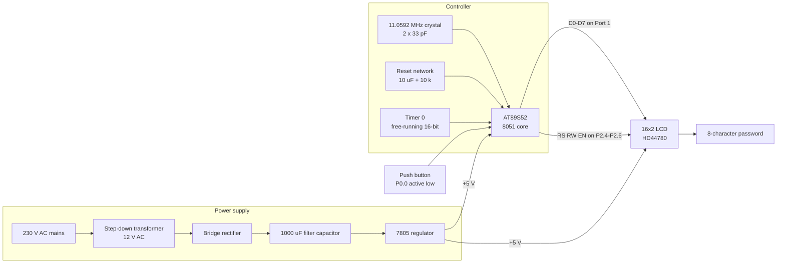
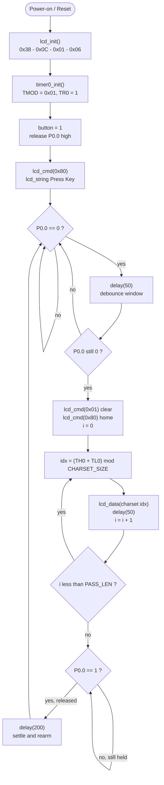
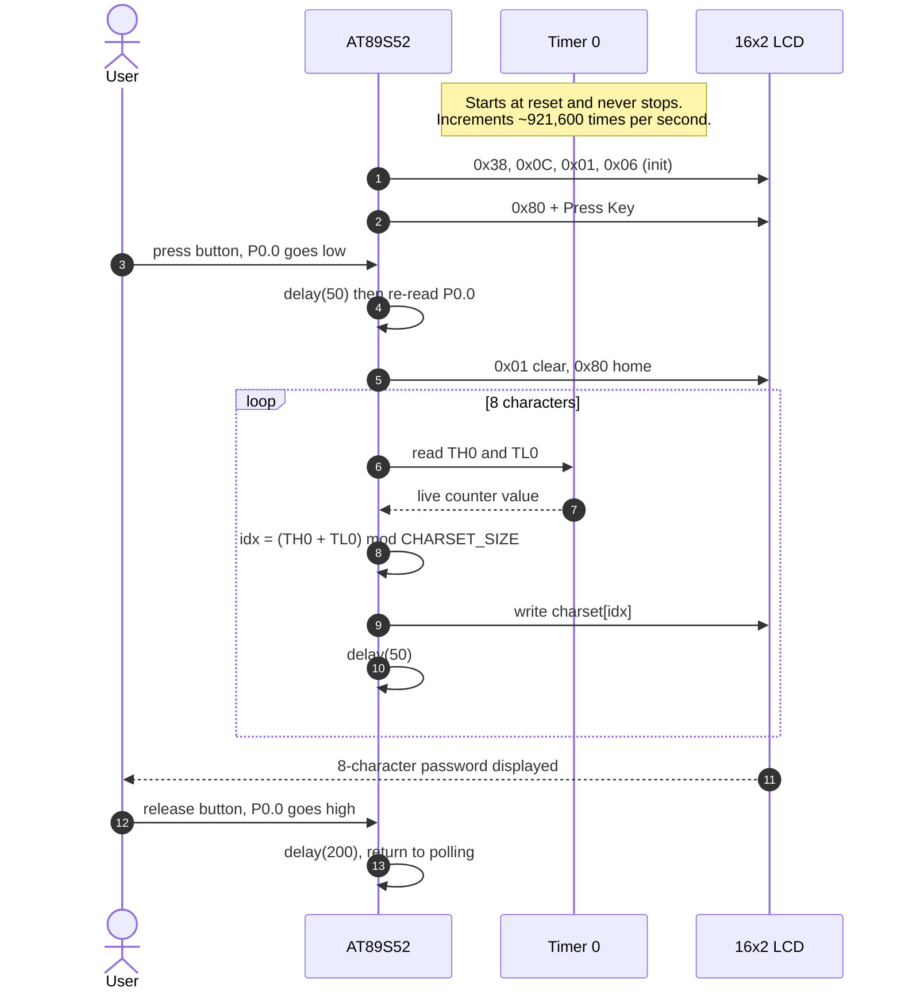

# Diagrams

All diagrams below are generated from the circuit and firmware, so they render directly on GitHub with no image files required. Mermaid blocks render as graphics; ASCII blocks are pin-accurate netlists you can wire from directly.

**Contents**

1. [System block diagram](#1-system-block-diagram)
2. [AT89S52 pin-level schematic](#2-at89s52-pin-level-schematic)
3. [LCD wiring detail](#3-lcd-wiring-detail)
4. [Support circuitry](#4-support-circuitry)
5. [Power supply chain](#5-power-supply-chain)
6. [Firmware flowchart](#6-firmware-flowchart)
7. [Runtime sequence](#7-runtime-sequence)
8. [LCD write strobe timing](#8-lcd-write-strobe-timing)
9. [Response time budget](#9-response-time-budget)

---

## 1. System block diagram



---

## 2. AT89S52 pin-level schematic

Physical pin numbers for the 40-pin DIP package. Only the pins actually used by this project are annotated; everything else is left unconnected.

```
                            AT89S52  (DIP-40)
                        +---------\__/---------+
        LCD D0  <-------|  1  P1.0     VCC  40 |-------> +5 V
        LCD D1  <-------|  2  P1.1     P0.0 39 |<------- PUSH BUTTON (active low)
        LCD D2  <-------|  3  P1.2     P0.1 38 |
        LCD D3  <-------|  4  P1.3     P0.2 37 |
        LCD D4  <-------|  5  P1.4     P0.3 36 |
        LCD D5  <-------|  6  P1.5     P0.4 35 |
        LCD D6  <-------|  7  P1.6     P0.5 34 |
        LCD D7  <-------|  8  P1.7     P0.6 33 |
     RESET NET  ------->|  9  RST      P0.7 32 |
                        | 10  P3.0/RXD  EA  31 |-------> +5 V  (run from internal flash)
                        | 11  P3.1/TXD  ALE 30 |
                        | 12  P3.2/INT0 PSEN29 |
                        | 13  P3.3/INT1 P2.7 28 |
                        | 14  P3.4/T0   P2.6 27 |-------> LCD EN
                        | 15  P3.5/T1   P2.5 26 |-------> LCD RW
                        | 16  P3.6/WR   P2.4 25 |-------> LCD RS
                        | 17  P3.7/RD   P2.3 24 |
     CRYSTAL    <-------| 18  XTAL2     P2.2 23 |
     CRYSTAL    <-------| 19  XTAL1     P2.1 22 |
           GND  ------->| 20  GND       P2.0 21 |
                        +----------------------+
```

**Notes**

- Port 0 is pins **39 down to 32** (P0.0 = pin 39, P0.7 = pin 32). This trips people up constantly — the button goes on **pin 39**, not pin 32.
- Pin 14 is `P3.4/T0`, the *external* Timer 0 input. This project clocks Timer 0 from the internal oscillator instead, so pin 14 stays unconnected.
- `EA` (pin 31) **must** be tied to +5 V. Left floating or grounded, the MCU tries to fetch code from external memory and nothing runs.

---

## 3. LCD wiring detail

```
  Power and contrast
  ------------------

   +5 V ---+------------------------------------> LCD pin  2   VDD
           |
           +---[ 10k pot ]---> wiper -----------> LCD pin  3   V0  (contrast)
           |
           +---[  220R   ]---------------------->  LCD pin 15   LED+ (backlight)

    GND ---+------------------------------------> LCD pin  1   VSS
           |
           +------------------------------------> LCD pin 16   LED-


  Data bus and control  (8-bit mode)
  ----------------------------------

   AT89S52                                        16x2 LCD
   -------                                        --------
   P1.0  (pin  1) -------------------------------> pin  7   D0
   P1.1  (pin  2) -------------------------------> pin  8   D1
   P1.2  (pin  3) -------------------------------> pin  9   D2
   P1.3  (pin  4) -------------------------------> pin 10   D3
   P1.4  (pin  5) -------------------------------> pin 11   D4
   P1.5  (pin  6) -------------------------------> pin 12   D5
   P1.6  (pin  7) -------------------------------> pin 13   D6
   P1.7  (pin  8) -------------------------------> pin 14   D7

   P2.4  (pin 25) -------------------------------> pin  4   RS
   P2.5  (pin 26) -------------------------------> pin  5   RW
   P2.6  (pin 27) -------------------------------> pin  6   EN
```

`RW` is driven low by the firmware and never read back, so it can alternatively be tied straight to ground to free up P2.5.

---

## 4. Support circuitry

### Clock oscillator

```
   XTAL1 (pin 19) ---+---[ 11.0592 MHz ]---+--- XTAL2 (pin 18)
                     |                     |
                  [ 33 pF ]             [ 33 pF ]
                     |                     |
                    GND                   GND
```

At 11.0592 MHz the 8051 machine cycle is 12 oscillator periods, giving a **921.6 kHz** timer increment rate — Timer 0 wraps its full 16-bit range about every 71 ms.

### Power-on reset

```
   +5 V
     |
  [ 10 uF ]
     |
     +-------------------> RST (pin 9)
     |
  [ 10 k ]
     |
    GND
```

The capacitor briefly pulls RST high at power-up and decays as it charges, producing an active-high reset pulse.

### Trigger button

```
   +5 V
     |
  [ 10 k ]      <-- required: Port 0 is open-drain with NO internal pull-ups
     |
     +-------------------> P0.0 (pin 39)
     |
    _|_
     o   push button (momentary, normally open)
    _|_
     |
    GND
```

Idle state reads logic 1. Pressing shorts P0.0 to ground and the firmware reads 0. Debouncing is entirely in software (50 ms confirm-and-recheck), so no RC filter is needed.

---

## 5. Power supply chain

```
    230 V AC          12 V AC          ~17 V DC          ~17 V DC           +5 V
  +----------+      +----------+      +----------+      +----------+     +--------+
  |  Mains   |      |  Step-   |      |  Bridge  |      | 1000 uF  |     |  7805  |
  |   L / N  |=====>|  down    |=====>| rectifier|=====>|  filter  |====>|  reg.  |====> +5 V rail
  |          |      |  Xfmr    |      |  (1 A)   |      |   cap    |     |        |
  +----------+      +----------+      +----------+      +----------+     +---+----+
                                                                            |
                                                                       [ 0.1 uF ]
                                                                            |
                                                                           GND
```

The +5 V rail feeds the AT89S52 (pin 40) and the LCD module (pin 2) in parallel. Fit 0.1 uF ceramics on both the input and output of the 7805, close to the package.

> **Safety.** The transformer primary carries mains voltage. For bench work, skip the mains section entirely and power the +5 V rail from USB or a regulated lab supply.

---

## 6. Firmware flowchart



The `CONF` branch back to `POLL` is what rejects contact chatter: a spurious low that has cleared within 50 ms never reaches the generation block. The `REL` wait is what prevents one sustained press from producing several passwords.

---

## 7. Runtime sequence



The key idea is that the timer is *never* read for timekeeping. It exists purely so that the value of `(TH0 + TL0)` at the unpredictable instant of a human button press is unpredictable too.

---

## 8. LCD write strobe timing

Every byte sent by `lcd_cmd()` and `lcd_data()` follows the same three-step pattern: set up the bus, raise `EN`, drop `EN`.

```
                 t = 0          t ~ 1 ms                 t ~ 3 ms
                   |                |                        |
                   v                v                        v

  D0-D7      ------+========================================+------
  (Port 1)         |         byte held stable                |
                   |                                         |
  RS         ------+-----------------------------------------+------
                   |   0 = command   /   1 = data            |
                   |                                         |
  RW         ------+-------------- 0 (write) ----------------+------
                   |                                         |
                   |     +-----------------+                 |
  EN         ------+-----+                 +-----------------+------
                         |                 |
                         |<-- delay(1) --->|<--- delay(2) --->|
                                           ^
                                           |
                            byte latched on the FALLING edge of EN
```

The `delay(2)` tail after `EN` drops is what gives the HD44780 controller time to finish executing the instruction. The clear-display command (`0x01`) is the slowest of the set, which is why a blanket 2 ms is used rather than polling the busy flag.

---

## 9. Response time budget


| Phase | Duration | Purpose |
|---|---|---|
| Debounce confirmation | ~50 ms | Reject contact chatter |
| Character generation and display | ~400 ms | 8 characters at 50 ms each, giving visible progressive rendering |
| Release wait | user-dependent | Prevents repeat triggers from one press |
| Post-release settle | ~200 ms | Lets the contact fully open before rearming |
| **Perceived latency** | **~400 ms** | Press to fully readable password |
